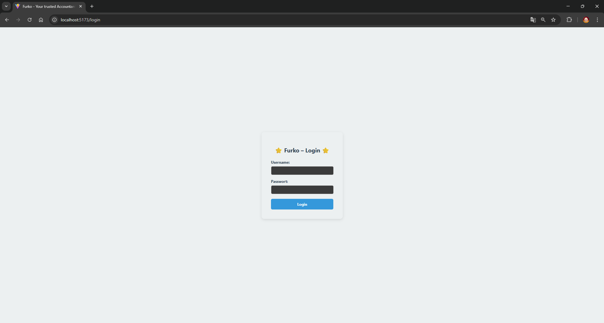
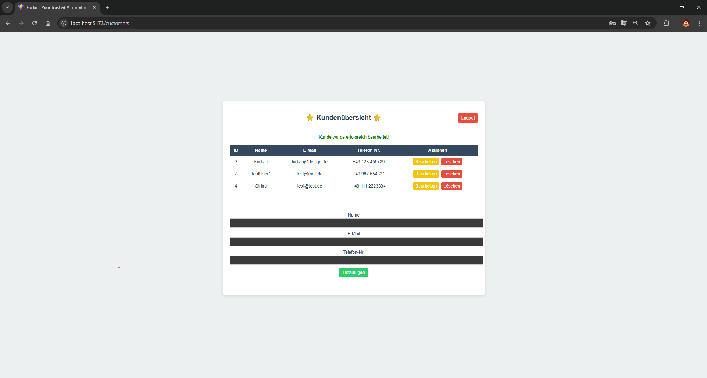

# Furko – Simple Invoice Management API

Furko is a lightweight, modular backend system for managing invoices and customers.  
Built with Java, Spring Boot, Hibernate, PostgreSQL and a React Frontend, this project is designed for learning full-stack development – from secure REST APIs to a modern web interface, testing and clean architecture.

## 🔧 Technologies Used

- Java 17
- Spring Boot
- Spring Data JPA (Hibernate)
- PostgreSQL
- Maven
- RESTful API
- JUnit 5
- React
- Docker
- ModelMapper (optional for DTO mapping)
- Bean Validation (JSR-380)

## 📦 Features (MVP)

- CRUD operations for customersUpdate 'README' with screenshots & project details
- CRUD operations for invoices
- Invoice status management (Open, Paid, Overdue)
- Validation of inputs (e.g. required fields, email format)
- Exception handling with global error responses
- Modular project structure (Controller - Service - Repository)
- Basic authentication (Spring Security)
- Unit testing with JUnit
- Dockerization for deployment
- Frontend integration (React)

## 📸 Screenshots

Here are some Screenshots of the current Furko Accounting System:

_Login page with centralized layout and basic authentication using Spring Security_

_Customers management page with CRUD operations (Add, Edit, Delete)_

## 🎯 Goal

This project was created to improve my backend development skills and to apply my background in accounting and finance in a technical context.  
It serves both as a **learning platform** and a **portfolio project**.

## 💡 Coming Soon (Optional Features)

- PDF generation of invoices
- E-Mail delivery of invoices

## 👤 About Me

Hi, I'm Furkan – a finance professional on the journey to becoming a full-stack developer.  
Furko is part of my learning path and job search preparation. I hope it inspires or helps others, too!

📧 Check out my other projects on [GitHub](https://github.com/FurkanK98)

---